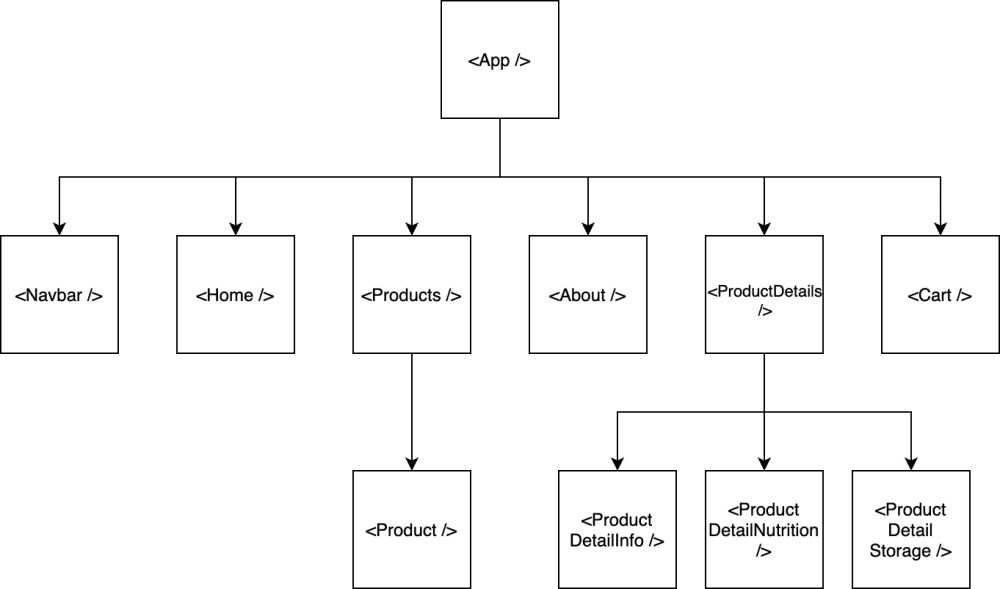

# Cool Online SuperM

## Introduction
This is a *test* online supermarket built with React. 

The webapp is hosted by Netlify, to visit: [Click me!](https://coolsuperm.netlify.app/)

## Local setup

To setup locally, `Node.js` and `npm` needs to be installed.

The project is handled with [Vite](https://vitejs.dev/). To install Vite: `npm create vite@latest`

Then run `npm run build`, or `npm run dev` if you wish to run the development version.

## Visit the site directly
[https://coolsuperm.netlify.app/](https://coolsuperm.netlify.app/)

## Components structure
